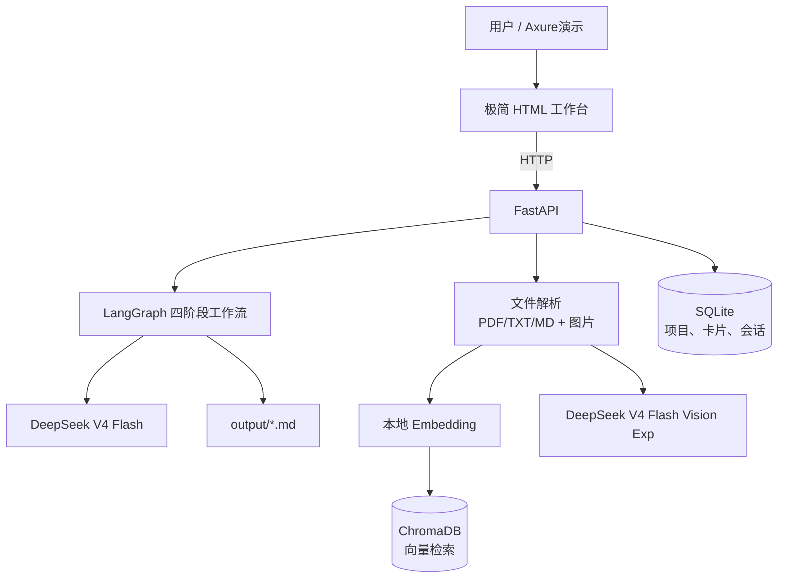

# 筑析 AI｜一日多 Agent 建筑场地调研与汇报 Demo

| 项目项 | 约定 |
|---|---|
| 目标 | 一天内完成可真实交互的 AI Demo，而非完整生产系统 |
| 产品定位 | 建筑设计前期资料的“提取—确认—诊断—策略—汇报”助手 |
| 产品原型 | Axure 展示全量产品流程；HTML 页面展示真实可运行链路 |
| 后端 | Python 3.11 + FastAPI + LangGraph |
| 大模型 | DeepSeek `deepseek-v4-flash`；图片分析使用 `deepseek-v4-flash-vision-exp` |
| RAG | ChromaDB 本地持久化向量库 + 本地中文 embedding 模型 |
| 数据 | SQLite + 本地 `uploads/` / `output/` 目录 |
| 明确边界 | 只用于课程/公开/脱敏资料；不是建筑设计、规范、消防或结构审查工具 |

---

## 1. 一句话介绍

筑析 AI 是一个面向建筑设计前期的多 Agent Demo。用户上传任务书、调研笔记、场地照片或总平面截图后，系统将资料转为带来源、待人工确认的场地事实与约束；在用户确认后，系统依次生成问题卡、可选策略和可编辑的“现状—问题—策略”Markdown 汇报大纲。

项目不主张 AI 自动做建筑方案，而是解决建筑前期资料分散、事实与判断混写、汇报逻辑难以建立的问题。

## 2. 必须跑通的真实闭环

```text
创建项目
  → 上传 1–3 份文本资料或 1–2 张场地图片
  → 资料提取 Agent 解析并生成洞察卡
  → 用户确认 / 修改 / 驳回洞察卡
  → 场地诊断 Agent 生成问题卡
  → 策略推演 Agent 生成 2–3 个策略卡
  → 用户勾选或编辑策略
  → 汇报生成 Agent 导出 Markdown 大纲
```

演示时至少使用一份可公开或脱敏的建筑任务书，以及一张场地照片或总平面截图。最终需要让观众亲眼看到：卡片可追溯、确认是下游门禁、导出的 Markdown 可继续修改。

## 3. 产品交互：Axure 与真实 HTML 的分工

| 载体 | 作用 | 是否真实调用 AI |
|---|---|---|
| Axure | 展示项目列表、资料库、分析台、策略选择、汇报编辑等完整产品蓝图 | 否，交互是预设模拟 |
| FastAPI 托管的极简 HTML | 上传文件、触发分析、确认卡片、生成策略、导出 Markdown | 是 |

Axure 原型可发布给他人浏览和点击，但不能替代真实模型、文件解析或数据库。答辩建议先展示 Axure 的完整产品设计，再展示 HTML 真正完成一次资料分析闭环。

## 4. 技术架构



### 文件与目录建议

```text
zhuaxi-ai/
├─ app/
│  ├─ main.py                 # FastAPI 入口和静态页
│  ├─ db.py                   # SQLite 连接、表初始化
│  ├─ schemas.py              # Pydantic 输入/输出模型
│  ├─ agents/
│  │  ├─ graph.py             # LangGraph 状态图
│  │  ├─ extractor.py         # 资料提取 Agent
│  │  ├─ diagnostician.py     # 场地诊断 Agent
│  │  ├─ strategist.py        # 策略推演 Agent
│  │  └─ reporter.py          # 汇报生成 Agent
│  ├─ services/
│  │  ├─ parser.py            # 文本/PDF 解析、图片保存
│  │  ├─ vision.py            # 图片结构化观察
│  │  ├─ rag.py               # 切块、embedding、Chroma 检索
│  │  └─ repositories.py      # 项目与卡片读写
│  └─ static/index.html       # 极简真实交互页面
├─ uploads/                   # 本地上传文件，不提交 Git
├─ chroma_data/               # 本地向量索引，不提交 Git
├─ output/                    # 导出的 Markdown
├─ .env                       # API Key，不提交 Git
├─ .env.example
└─ requirements.txt
```

## 5. 四个 Agent 的职责与连接

Agent 不是彼此自由聊天，而是通过 LangGraph 的共享状态、SQLite 数据和 RAG 检索结果顺序协作。

```text
资料提取 Agent
   ↓ 待确认洞察卡
用户确认
   ↓ 已确认项目事实
场地诊断 Agent
   ↓ 问题卡
策略推演 Agent
   ↓ 候选策略卡
用户选择策略
   ↓
汇报生成 Agent
   ↓ Markdown 大纲
```

| Agent | 输入 | 可调用工具 | 结构化输出 | 关键门禁 |
|---|---|---|---|---|
| 资料提取 `extractor` | 文档文本、图片观察、检索片段 | `read_document_text`、`analyze_site_image`、`save_insight_cards` | 事实 / 约束 / 诉求 / 信息缺口卡 | 没有来源不得标为事实。 |
| 场地诊断 `diagnostician` | 已确认洞察卡、RAG 检索片段 | `get_confirmed_insights`、`retrieve_project_context`、`save_problem_cards` | 问题卡 | 每个问题须关联确认事实，或标为待验证假设。 |
| 策略推演 `strategist` | 已选问题、证据片段 | `get_problem_cards`、`retrieve_project_context`、`save_strategy_cards` | 策略卡 | 至少说明前提、取舍和待验证项。 |
| 汇报生成 `reporter` | 已确认事实、已选问题、用户选定策略 | `get_selected_content`、`export_markdown` | Markdown 大纲/正文 | 不生成新事实或未经选择的策略。 |

### 为什么“策略”和“汇报”要分两个 Agent

策略推演是方案选择：模型应该提出多个备选和取舍，用户需要介入。汇报生成是表达组织：它只能整理用户已经确认和选定的内容。拆开后，模型不会在生成汇报时悄悄替用户做设计决策，也能清楚展示多 Agent 的职责边界。

## 6. 最方便的工具调用方式

工具是后端受控的 Python 函数，不是需要单独购买或部署的外部服务。用 LangChain `@tool` 封装后可挂给相应 Agent；但首版推荐“后端确定性执行 + 模型严格 JSON 输出”，比让模型自由调用更稳定。

```python
@tool
def retrieve_project_context(project_id: str, query: str, top_k: int = 5) -> list[dict]:
    """从指定项目的 Chroma 向量库返回相关片段、文件名和页码。"""

@tool
def get_confirmed_insights(project_id: str) -> list[dict]:
    """读取该项目用户已经确认的洞察卡。"""

@tool
def save_problem_cards(project_id: str, cards_json: str) -> str:
    """校验并保存问题卡。"""

@tool
def export_markdown(project_id: str) -> str:
    """把用户选定内容导出到 output/。"""
```

一天版的稳定调用方式：

```text
用户点击“生成问题”
→ 后端固定读取 confirmed insight cards
→ 后端固定调用 RAG 检索
→ DeepSeek 返回符合 Pydantic Schema 的问题卡 JSON
→ 后端校验 JSON
→ 后端固定保存问题卡
```

任务日志可显示为“诊断 Agent 检索到 5 个资料片段 → 基于 6 条确认卡生成 3 个问题 → 保存成功”，既可解释工具调用，也方便排错。

## 7. RAG：最低可用、可真实讲述的实现

### RAG 链路

```text
上传 PDF/TXT/MD
→ 提取文本和页码
→ 按约 500–800 字分块，带 overlap
→ 本地中文 embedding
→ 写入 ChromaDB（metadata 含 project_id、文件名、页码）
→ Agent 按任务 query 检索 Top 5
→ DeepSeek 只基于检索结果生成结构化内容
→ 卡片回写来源文件和页码
```

每次检索必须以 `project_id` 过滤，避免不同项目资料串用。第一版使用 ChromaDB 本地持久化即可；不要在一天版引入 PostgreSQL + pgvector、云向量数据库或额外付费 API。

### 故障降级

如果本地 embedding 模型下载或 Chroma 依赖出问题，立即改为 SQLite 全文检索，让主闭环继续可用。演示和文档应如实说明：RAG 分支当日是否成功启用，不将关键词检索称为向量检索。

## 8. 场地图片识别

资料提取 Agent 包含视觉解析分支。文本资料使用 `deepseek-v4-flash`；JPG/PNG 场地照片、总平面截图使用 `deepseek-v4-flash-vision-exp`。该视觉模型为实验模型，支持图片输入；以官方接口说明为准。[DeepSeek API 文档](https://api-docs.deepseek.com/)

```text
上传场地照片 / 总平面截图
→ 保存原图
→ Vision 模型提取可见要素、图中文字、待核实项
→ 生成 source_type=image_observation 的待确认洞察卡
→ 图片描述文本作为 Chunk 写入 ChromaDB
```

视觉模型可提取入口、道路、绿化、建筑界面、停车、人流、标识与图面文字；不能将单张照片推断为准确面积、限高、日照、消防或结构结论。看不清的文字和推断必须标记为 `pending` 或 `needs_verification`。

## 9. 短期记忆与长期记忆

| 层级 | 主键 | 存什么 | 管理方法 |
|---|---|---|---|
| 短期记忆 | `thread_id` | 当前会话消息、当前任务状态 | SQLite `messages` 表；每次只取最近 10 条。 |
| 长期项目记忆 | `project_id` | 用户已确认的事实、约束、诉求、问题与策略 | SQLite 卡片表；只能由用户确认或选择后进入下游。 |
| 临时工作状态 | LangGraph state | `project_id`、`thread_id`、本次选中的卡片 ID、下一节点 | 单次执行结束后不作为永久事实存储。 |

```python
class ArchitectureAgentState(TypedDict):
    messages: Annotated[list, add_messages]
    project_id: str
    thread_id: str
    confirmed_insight_ids: list[str]
    next: str | None
```

这相当于把原问诊项目中的 Postgres Checkpoint / Store 映射为 SQLite 的会话表和可审计业务表。以后真需要多人协作和云部署时，再替换为 PostgreSQL，不改变 Agent 职责。

## 10. 数据模型

```text
projects(id, name, type, description, created_at)
documents(id, project_id, file_name, file_type, path, parse_status)
source_chunks(id, document_id, page_number, content, source_type)
conversations(id=thread_id, project_id, title, created_at)
messages(id, thread_id, role, content, created_at)
insight_cards(id, project_id, category, content, source_file, source_page,
              source_quote, confidence, review_status)
problem_cards(id, project_id, content, linked_insight_ids, status)
strategy_cards(id, project_id, problem_id, name, actions, preconditions,
               tradeoffs, selected)
agent_runs(id, project_id, agent_name, status, duration_ms, summary)
```

首版不做注册、JWT 和多用户权限。页面用一个本地 Demo 用户，但表中仍保留 `project_id`，以便后续扩展隔离。

## 11. DeepSeek 配置

```env
# .env：不提交 Git，不在前端代码、录屏或聊天中展示
DEEPSEEK_API_KEY=由用户提供
DEEPSEEK_BASE_URL=https://api.deepseek.com
DEEPSEEK_TEXT_MODEL=deepseek-v4-flash
DEEPSEEK_VISION_MODEL=deepseek-v4-flash-vision-exp
```

`deepseek-v4-flash` 走 OpenAI 兼容接口，支持结构化 JSON 与工具调用；模型与接口细节以 [DeepSeek 官方文档](https://api-docs.deepseek.com/) 为准。所有路由和卡片输出均使用低温度与 Pydantic Schema 校验；失败最多重试一次，再向页面返回可理解的错误信息。

## 12. 一天实施计划

| 时段 | 交付 | 完成标准 |
|---|---|---|
| 0–1 小时 | 环境与 DeepSeek 连通 | `.env` 生效，文本模型返回测试 JSON。 |
| 1–3 小时 | FastAPI、SQLite、HTML、上传与文本解析 | 能上传 TXT/MD/文本 PDF 并看到解析文本。 |
| 3–5 小时 | 资料提取 + 审核卡片 | 生成带来源的洞察卡，用户可确认/修改。 |
| 5–6 小时 | RAG | Chunk、Chroma 检索、任务日志显示引用来源。 |
| 6–8 小时 | 诊断、策略、汇报三节点 | 能生成问题、勾选策略、下载 Markdown。 |
| 8–9 小时 | 图片分支与测试 | 至少一张场地图片形成待确认观察卡。 |
| 9–10 小时 | Axure、README、录屏 | 完成一次 3 分钟端到端演示。 |

### 今天绝不做

- 用户注册、JWT、多人协作；
- PostgreSQL、pgvector、Docker 云部署；
- 扫描 PDF 的复杂 OCR、CAD/BIM、批量图片；
- 外网案例搜索、专业规范审查、自动出方案；
- 没有证据支撑的量化结果。

## 13. 配置责任

| 内容 | 我可以处理 | 需要你处理 |
|---|---:|---:|
| FastAPI/LangGraph/SQLite/Chroma/HTML 代码 | 是 | 否 |
| Agent Prompt、Schema、工具、RAG 与测试数据 | 是 | 否 |
| DeepSeek 接入与 `.env.example` | 是 | 否 |
| API Key 写入本机 `.env` | 在你明确提供 Key 后可以 | 提供 Key，且不把它公开到截图或 Git |
| DeepSeek 账号、额度、充值 | 否 | 是 |
| Python / Node 运行环境安装 | 可检查与协助 | 如需管理员权限或下载授权，由你确认 |
| 演示建筑资料版权和脱敏 | 否 | 是 |
| Axure 原型页面 | 可协助梳理页面和文案 | 你使用自己的 Axure 完成或授权我按素材协作 |

## 14. 作品集表述与证据边界

可在真实完成后使用：

> 基于建筑设计前期资料分散、事实与策略容易混写的痛点，独立使用 FastAPI、LangGraph、ChromaDB 和 DeepSeek API 搭建“筑析 AI”多 Agent Demo。系统通过项目级向量检索提取带来源的洞察卡，设置人工确认门禁后依次生成问题、策略和汇报大纲，并支持场地图片的多模态信息提取与 Markdown 导出。

只能陈述已经完成并可演示的功能。用户访谈、上线、准确率、效率提升或用户数必须在有原始记录时才写入简历。

## 15. 演示脚本（3 分钟）

1. **问题（20 秒）**：展示分散的任务书、照片和调研记录，说明事实、判断、策略易混写。
2. **上传与 RAG（40 秒）**：上传任务书和场地图片，展示解析状态及“检索到的来源片段”。
3. **人工确认（40 秒）**：展示一张限高/出入口卡片的原文或图片来源，确认或修改它。
4. **问题与策略（50 秒）**：生成问题卡；展示两个策略的前提和取舍，勾选其中一个。
5. **汇报输出（30 秒）**：生成并下载 Markdown，强调汇报只包含确认事实和选定策略。

## 16. 启动前检查

- [ ] 已提供并验证 DeepSeek API Key。
- [ ] Python 3.11+ 可用。
- [ ] 至少准备一份公开/脱敏的任务书和一张场地图片。
- [ ] `.env`、`uploads/`、`chroma_data/` 已加入 `.gitignore`。
- [ ] 文本资料闭环已跑通后，再启用 Chroma 和视觉分支。
- [ ] 录屏前用全新项目跑一遍，不展示 API Key、绝对路径或敏感资料。
