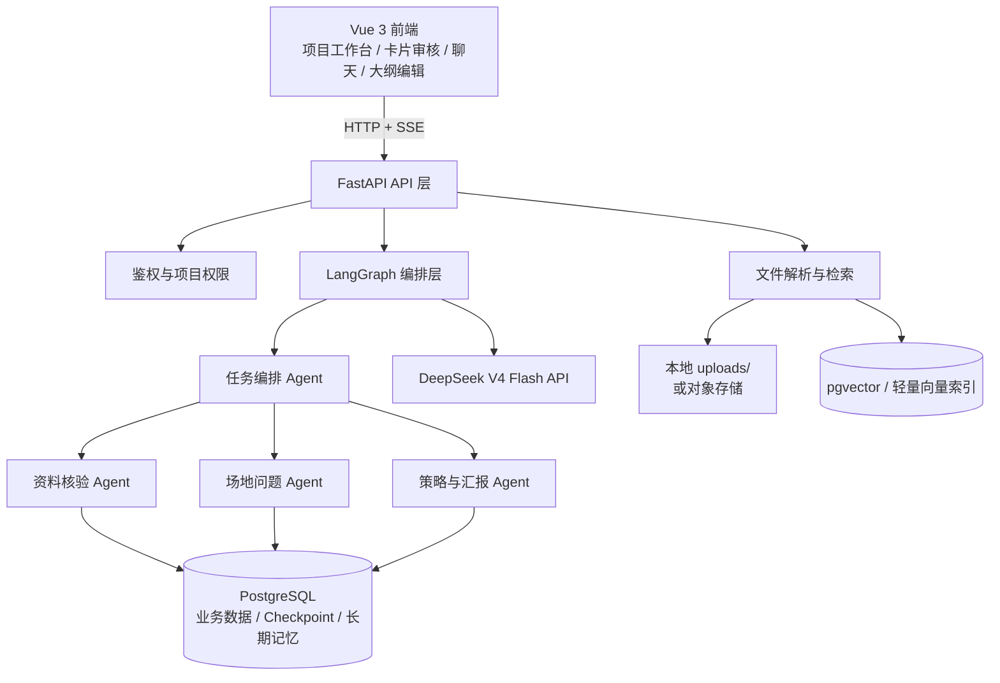

# 筑析 AI｜多 Agent 建筑场地调研与方案汇报助手

| 项目属性 | 说明 |
|---|---|
| 版本 | V1.0（可演示 MVP 设计） |
| 项目形态 | Vue 3 + FastAPI + LangGraph 的全栈 Web Demo |
| 模型 | DeepSeek `deepseek-v4-flash`（OpenAI 兼容接口） |
| 目标用户 | 建筑学学生、初级建筑设计人员 |
| 核心价值 | 将分散的前期资料转为可追溯、可确认的“事实—问题—策略—汇报”链路 |

## 1. 复刻范围与改造原则

参考的“智能问诊 AI 客服”材料只含流程说明、技术栈与关键代码截图，**不含可运行源码**。本项目采用同构架构复刻：保留 Vue 3、FastAPI、LangGraph、会话隔离、短/长期记忆、PDF 上传和流式对话；业务实体、Prompt、数据模型和页面全部替换为建筑设计前期场景。

不保留医疗语义，也不输出规划、消防、结构或法规合规结论。所有数值指标、规范相关信息及场地判断必须经用户确认，并保留证据来源。

## 2. 为什么选“建筑场地调研与方案汇报”

这是最适合多 Agent 的建筑学场景：它有连续但边界清晰的子任务，且每一步都能被用户检查。

```text
任务书 / 场地资料 / 照片 / 调研笔记
              ↓
资料解析与证据检索
              ↓
事实、约束、诉求、信息缺口（人工确认）
              ↓
问题卡（必须关联确认事实）
              ↓
策略卡（说明前提、取舍、待验证项）
              ↓
可编辑的“现状—问题—策略”汇报大纲
```

相比“自动画建筑方案”，这个切入点更可控：AI 的输出有来源、有人工确认点，也更适合在 Demo 中展示 AI 工程能力。

## 3. 用户故事与 MVP 范围

用户创建一个课程设计项目，上传任务书、规划条件、场地照片说明和调研笔记；系统提取信息卡片，用户逐条确认后生成问题与策略，最后导出 Markdown 汇报大纲。

### P0（本次框架必须实现）

- 项目、登录、会话管理与项目级数据隔离；
- PDF / DOCX / TXT / Markdown 上传、文本解析和来源定位；
- 事实、约束、诉求、信息缺口四类洞察卡，以及确认/编辑/驳回；
- 多 Agent 编排、SSE 流式状态反馈与对话记录；
- 问题卡、策略卡和带来源编号的 Markdown 大纲；
- 任务日志、失败重试和模型输出 Schema 校验。

### 明确不做（MVP 边界）

- 直接生成建筑方案、施工图、真实规范审查或效果图；
- 自动抓取外网案例；
- BIM/Revit 集成、多人实时协作；
- 将模型输出冒充为专业结论。

## 4. 总体架构



### 技术栈

| 层 | 选型 | 理由 |
|---|---|---|
| 前端 | Vue 3 + Vite + TypeScript + Pinia | 延续参考项目的 Vue 架构，适合工作台式交互。 |
| 后端 | Python 3.11 + FastAPI + Uvicorn | 异步 API、上传与 SSE 支持直接。 |
| Agent | LangChain + LangGraph | 状态图、可恢复 Checkpoint、工具与模型调用封装。 |
| 模型 | `langchain-openai` 连接 DeepSeek | DeepSeek 提供 OpenAI 兼容接口，替换成本低。 |
| 数据 | PostgreSQL 16 + SQLAlchemy + psycopg | 一个数据库承载业务数据、LangGraph 短/长期记忆和向量检索。 |
| 文档 | PyPDF、python-docx、可选 OCR | 支持任务书和调研资料。 |
| 检索 | pgvector（MVP 可先用 PostgreSQL 文本检索） | 来源可追溯，减少额外组件。 |
| 运行 | Docker Compose | 一条命令启动前端、后端和数据库，便于作品集演示。 |

## 5. 多 Agent 设计

不要让 Agent 自由互聊；采用受控的“编排—执行—统一收尾”状态图。

| 节点 | 职责 | 输入 | 输出 / 门禁 |
|---|---|---|---|
| `orchestrator` | 识别用户当前任务，选择节点并汇总 | 当前消息、项目状态、已确认信息 | 严格 JSON 路由；不解析自然语言节点名。 |
| `evidence_extractor` | 从资料和检索片段提取洞察卡 | 文档片段、页码、用户补充 | 每项必须附来源；无来源只能是信息缺口。 |
| `site_diagnostician` | 基于已确认信息生成问题卡 | 已确认事实/约束/诉求 | 每张问题卡至少关联一条确认事实，或显式标为假设。 |
| `strategy_planner` | 生成可选策略和汇报大纲 | 用户选定的问题卡 | 输出前提、取舍和待验证事项，不称唯一正确方案。 |
| `finalizer` | 统一格式化回复、写入状态与审计日志 | 子节点结构化结果 | 未确认事实不得进入正式汇报。 |

```text
START → orchestrator
      ├─ extract / update资料 → evidence_extractor → finalizer → END
      ├─ 生成问题             → site_diagnostician → finalizer → END
      ├─ 生成策略或大纲        → strategy_planner → finalizer → END
      └─ 普通问答             → finalizer → END
```

这比参考项目截图中“子 Agent 直接 END”更一致：所有执行节点均回到 `finalizer`，因此可统一做审计、状态更新和安全提示。

## 6. 共享状态、数据与隔离

```python
class ArchitectureAgentState(TypedDict):
    messages: Annotated[list, add_messages]
    user_id: str
    project_id: str
    thread_id: str
    selected_document_ids: list[str]
    confirmed_insight_ids: list[str]
    pending_cards: list[dict]
    next: str | None
    trace_id: str
```

| 隔离层 | 键 | 用途 |
|---|---|---|
| 用户级 | `user_id` | 用户账号、长期偏好、权限。 |
| 项目级 | `project_id` | 文件、洞察卡、问题卡、策略卡和汇报内容；检索必须带此过滤条件。 |
| 会话级 | `thread_id` | LangGraph Checkpoint 与聊天上下文。 |
| 数据类别 | `namespace` | 将项目事实、用户偏好、操作审计分开保存。 |

核心表：`users`、`projects`、`documents`、`source_chunks`、`insight_cards`、`problem_cards`、`strategy_cards`、`outlines`、`agent_runs`。所有业务查询均须同时按 `user_id` 与 `project_id` 校验，不能只信任前端传入的项目 ID。

## 7. API 与页面

| 模块 | 关键接口 / 页面 | 说明 |
|---|---|---|
| Auth | `POST /auth/register`、`POST /auth/login` | bcrypt 哈希密码，JWT 放 HTTP-only Cookie 或 Bearer Token。 |
| 项目 | `/projects`、项目列表页 | 创建、编辑、删除及访问控制。 |
| 文档 | `POST /projects/{id}/documents` | 上传、解析、索引和状态查询。 |
| 分析台 | `/insight-cards` | 卡片筛选、引用原文、确认、修改、驳回。 |
| 对话 / 任务 | `POST /projects/{id}/chat/stream` | SSE 返回 `route`、`progress`、`card`、`message`、`error` 事件。 |
| 问题与策略 | `/problem-cards`、`/strategy-cards` | 用户选择和编辑后才生成下游内容。 |
| 汇报 | `/outlines`、`/export/markdown` | 章节重排、来源编号、Markdown 导出。 |

前端主要为：项目列表、项目工作台（资料库/分析台/问题策略/汇报/任务记录五个 Tab）和登录页。聊天区不是产品主入口，而是补充式任务控制面板。

## 8. DeepSeek V4 Flash 接入

DeepSeek 当前官方接口兼容 OpenAI Chat Completions；Base URL 为 `https://api.deepseek.com`，模型别名为 `deepseek-v4-flash`。该模型支持 JSON 输出和工具调用，适合路由和结构化卡片提取。官方定价和可用模型会变化，实际部署前以模型列表接口为准。[官方文档](https://api-docs.deepseek.com/)

```env
# backend/.env（仅本地保存，绝不提交 Git）
DEEPSEEK_API_KEY=等待用户提供
DEEPSEEK_BASE_URL=https://api.deepseek.com
DEEPSEEK_MODEL=deepseek-v4-flash
DATABASE_URL=postgresql+psycopg://zhuaxi:change-me@db:5432/zhuaxi
JWT_SECRET=请生成随机长字符串
UPLOAD_DIR=./uploads
```

```python
from langchain_openai import ChatOpenAI

model = ChatOpenAI(
    model=os.environ["DEEPSEEK_MODEL"],
    api_key=os.environ["DEEPSEEK_API_KEY"],
    base_url=os.environ["DEEPSEEK_BASE_URL"],
    temperature=0.2,
)
```

实现时，路由和卡片提取要使用 Pydantic Schema / 工具调用来校验；模型超时、返回非结构化内容或 Schema 失败时，最多重试一次，再返回可操作错误。对于场地照片理解，后续可在确有需求时换用 `deepseek-v4-flash-vision-exp`，但图片 OCR 和结构化事实确认仍保留。

## 9. 配置责任清单

| 项目 | 我可以完成 | 你必须手动完成 | 备注 |
|---|---:|---:|---|
| 项目代码、目录、Docker Compose、数据库迁移 | 是 | 否 | 可在本机直接生成与运行。 |
| DeepSeek 模型接入与 `.env.example` | 是 | 否 | 代码使用 `deepseek-v4-flash`。 |
| DeepSeek API Key 填入本机 `.env` | 可在你明确授权后代填 | **需要你提供 Key** | 不在对话、截图、Git 或前端暴露密钥。 |
| DeepSeek 账号注册、实名认证、充值/额度 | 否 | **是** | 涉及你的账户、费用和外部服务授权。 |
| Docker Desktop / Python / Node.js 安装 | 可协助检测和安装 | 可能需要你确认管理员授权 | 最低要求：Docker Desktop；本地开发也可用 Python 3.11 + Node 20。 |
| PostgreSQL 本地容器 | 是 | 否 | Docker 正常时由 Compose 创建。 |
| 域名、云服务器、对象存储、部署平台 | 可以配置代码与部署方案 | **需要你授权账户登录与付费** | MVP 可先仅本机运行。 |
| 联网搜索 API（Tavily 等） | 可接入 | 仅在启用该功能时提供 Key | MVP 不需要；避免无来源外网信息混入项目资料。 |
| 真实建筑资料与使用许可 | 否 | **是** | 建议先用公开或脱敏课程资料。 |

## 10. 安全、质量与可演示性

- 密钥只在后端环境变量中读取；`.env` 加入 `.gitignore`。
- 文件限制类型/大小，解析前做扩展名与 MIME 校验；生产环境还要病毒扫描。
- 每一项模型输出记录任务 ID、输入文档 ID、模型版本、耗时和 Schema 校验状态，但不在普通日志保存完整敏感资料或密钥。
- 数值约束、OCR 低可信、资料冲突、来源缺失和法规相关内容强制人工确认。
- 准备至少 30 条离线评测样本，衡量来源可追溯率、关键约束召回率、结构化成功率、人工修改率与平均耗时；没有实际测试，不写任何提升百分比。

## 11. 实施顺序与验收

1. **基础框架（第 1 周）**：Vue/FastAPI/Docker、JWT、项目隔离、文件上传、PostgreSQL。
2. **可控 AI 链路（第 2 周）**：DeepSeek 接入、文档切片检索、洞察卡 Schema 与人工审核台。
3. **多 Agent 闭环（第 3 周）**：LangGraph 路由、问题/策略/大纲节点、SSE 和 `agent_runs` 日志。
4. **打磨与证据（第 4 周）**：测试集、Badcase、演示数据、README、3 分钟演示录屏。

首版验收：上传至少 5 份资料后，用户能够查看每张卡的原始引用；未确认内容不会进入大纲；问题能回链已确认事实；策略能说明取舍和待验证项；导出的 Markdown 可继续修改；失败的解析或模型任务可重试。

## 12. 作品集/面试叙事（真实边界）

可以将它定位成个人 Vibe Coding Demo：

> 我观察到建筑设计前期的任务书、调研笔记和场地资料分散，且“事实、判断、策略”常被混写，于是独立用 Vue、FastAPI、LangGraph 和 DeepSeek API 搭建了筑析 AI。它把资料解析为带来源的洞察卡，要求人工确认后才生成问题、策略和汇报大纲；我通过结构化输出、项目隔离和任务日志控制多 Agent 的可靠性与可追溯性。

前提是你确实完成了所述实现、测试和演示。不要声称已做用户访谈、上线、获得用户量或实现提效比例，除非保留了对应证据。更准确的说法是“基于建筑设计前期的资料整理痛点提出并实现个人 Demo”。

## 13. 下一步

收到 DeepSeek API Key 后，先写入本机未提交的 `backend/.env`，调用 `GET /models` 验证权限和模型名，再运行一轮健康检查（模型响应、数据库、文件解析、结构化卡片）。随后按第 11 节从基础框架开始搭建。
